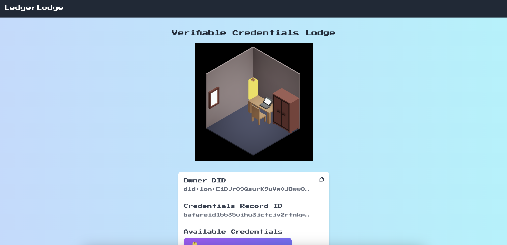
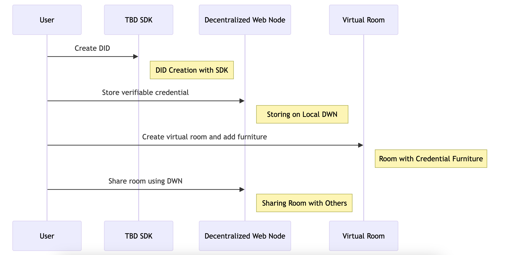

# LedgerLodge

Gamification of verifiable credential sharing.

## Live Demo

https://ledgerlodge.vercel.app/

## Video Demo

https://youtu.be/y46KfjZelmU

## Pitch Deck

https://docs.google.com/presentation/d/19MlljzXwNkPih7dosxq12tJUqfaCbQk1zKXDeI9NkU8/edit?usp=sharing

## Description

LedgerLodge is new experience of credential sharing with gamification. By TBD's decentralized identity SDK, users can securely store their credentials on local Decentralized Web Nodes (DWN), crafting personalized public rooms with virtual furniture to display these credential between users via DWN.

## How it works

- User can create did with TBD SDK
- User can store verifiable credential with local DWN
- User can create virtual room and put furniture which contains credential
- User can share the room with others using DWN

## Assets

### Images

We use this free asset to implement the room with furnitures.

https://www.gamedevmarket.net/asset/free-isometric-voxel-room-with-furnitures

### Sounds

We use "Elevator to Nowhere" by Aldous Ichnite as BGM in the game.
https://freemusicarchive.org/music/aldous-ichnite/paper-trails-and-pixels/elevator-to-nowhere/
